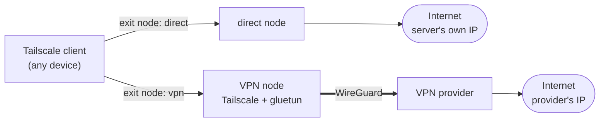

# gluetail

Tailscale exit nodes that can leave through a VPN provider, with a CLI and a small web UI to change where they exit.

gluetail runs [Tailscale](https://tailscale.com) exit nodes in Docker on a server you control. A node either
exits through the server's own connection or through a VPN provider via
[gluetun](https://github.com/qdm12/gluetun). Choose a node in the Tailscale client on any device, and change a
VPN node's country or city from the CLI or the web UI without touching the server.

- **Several exit nodes side by side**: one direct, one per VPN provider or region, each selectable per device.
- **Any provider gluetun supports**: filters such as country, city and provider-specific options are generated
  from gluetun's own server data.
- **Declarative**: one small env file per node, rendered into a Compose file by `gluetail up`.
- **Live changes**: switch location through gluetun's control API; the choice is saved to the node file.



> **Status:** early. Tested with ProtonVPN (free plan) and Docker Compose v2 on Ubuntu. Mullvad and
> paid-plan features are untested.

## Quick start

Requirements: a Linux host with Docker, Compose v2 and `/dev/net/tun`, and a Tailscale account with MagicDNS.
The one-time admin-console steps (auth key, approving exit nodes) are in [docs/tailscale-setup.md](docs/tailscale-setup.md).

```bash
git clone https://github.com/oallw/gluetail && cd gluetail
cp .env.example .env
cp nodes/direct.env.example nodes/direct.env
umask 077 && mkdir -p secrets data
echo 'TS_AUTHKEY=tskey-auth-...' > secrets/tailscale.env
./gluetail up
```

Approve the node as an exit node in the Tailscale admin console, then select it on a device.

To add a VPN node:

```bash
cp nodes/proton.env.example nodes/proton.env
echo 'WIREGUARD_PRIVATE_KEY=...' > secrets/proton.env
sed -i 's/^COMPOSE_PROFILES=.*/COMPOSE_PROFILES=direct,proton/' .env
./gluetail up
```

## Usage

```bash
./gluetail nodes                                   # configured nodes and their state
./gluetail status                                  # exit IP and location of each VPN node
./gluetail options proton                          # filters available for a node
./gluetail set proton countries=Japan cities=Tokyo # change location live, saved to the node file
./gluetail up                                      # apply configuration changes
```

The same controls are available in a web UI (`ui` profile), see [docs/web-ui.md](docs/web-ui.md).

## Configuration

A node is a file, `nodes/<name>.env`. Keys starting with `GLUETAIL_` configure gluetail; everything else is
passed to gluetun unchanged, so any option your provider supports works:

```ini
GLUETAIL_SECRETS=./secrets/proton.env
VPN_SERVICE_PROVIDER=protonvpn
VPN_TYPE=wireguard
SERVER_COUNTRIES=Netherlands
```

## Documentation

- [Tailscale setup](docs/tailscale-setup.md): auth key, approving exit nodes, auto-approval
- [Configuration](docs/configuration.md): `.env`, node files, versions, systemd
- [CLI](docs/cli.md): commands, generated filters, how changes are applied
- [Web UI](docs/web-ui.md): enabling it, access options, security model
- [Attaching containers](docs/attaching-containers.md): routing other containers through a node
- [Troubleshooting](docs/troubleshooting.md): implementation notes and known issues
- [SECURITY.md](SECURITY.md)

## License

MIT, see [LICENSE](LICENSE). The bundled JetBrains Mono font in `web/fonts/` is under the SIL Open Font
License 1.1 (`web/fonts/OFL.txt`).

gluetail is an independent project, not affiliated with or endorsed by Tailscale Inc., the gluetun project,
Proton AG, Mullvad VPN AB or JetBrains. Using a VPN provider through it is subject to that provider's terms.
