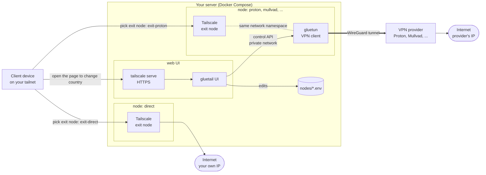

# gluetail

Tailscale exit nodes you pick from any device: one with no VPN, others that
send your traffic out through a VPN provider via [gluetun](https://github.com/qdm12/gluetun).

> Status: early. Working: `direct` (no VPN) and VPN nodes (ProtonVPN tested), a CLI, and a
> mobile-friendly web UI with filters generated from gluetun's server data. Untested: Mullvad
> and paid-plan filters (no account available to test with).

## How it works



- Every **exit node** is a Tailscale container that advertises itself as an exit node. You choose
  one (or none) in the Tailscale app on any device.
- A **VPN node** runs its Tailscale container *inside a gluetun container's network namespace*, so
  everything it forwards leaves through gluetun's VPN tunnel. The **direct** node has no gluetun and
  uses the server's own connection.
- The **CLI** and the **web UI** change a VPN node's country, city and other filters live through
  gluetun's control API, and remember the choice in `nodes/<name>.env`.

## Prerequisites on a new machine

1. **Docker + Compose v2**, and `/dev/net/tun` on the host (`ls /dev/net/tun`).
2. **A Tailscale account/tailnet.** The host does not need Tailscale installed:
   every node here is its own tailnet device.
3. **Tailscale admin console settings** (https://login.tailscale.com/admin):
   - *DNS*: MagicDNS enabled.
   - *DNS → HTTPS Certificates*: enabled (needed later for the web UI via
     `tailscale serve`; not needed for the plain exit nodes).
4. **An auth key** (Settings → Keys → *Generate auth key*):
   - *Reusable*: on, so you can recreate nodes.
   - *Ephemeral*: **off**, or nodes disappear when they go offline.
   - *Pre-approved*: on if your tailnet requires device approval.
   - *Tags*: optional. If you use tags, add them in the ACL `tagOwners`; with
     tags, also add an `autoApprovers` rule (below) so exit nodes need no
     manual approval.
5. **Disable node key expiry** for each node (Machines → ⋯ → *Disable key
   expiry*). Auth keys expire (max 90 days) but only matter at first
   registration; each *node* key separately expires after 180 days by default,
   which would silently take the exit node offline.
6. **Approve each exit node** (once per node), unless you use `autoApprovers`:
   Machines → the node (`exit-direct`) → ⋯ → *Edit route settings* →
   tick *Use as exit node*.

Optional ACL snippet to skip step 6 (replace the tag with your own):

```json
"tagOwners":     { "tag:exit-node": ["autogroup:admin"] },
"autoApprovers": { "exitNode": ["tag:exit-node"] }
```

Then pass `--advertise-tags=tag:exit-node` through `DIRECT_TS_EXTRA_ARGS` in `.env`
and generate the auth key with that tag.

## Quick start

```bash
cp .env.example .env                              # install-level settings
cp nodes/direct.env.example nodes/direct.env      # one file per exit node
cp nodes/proton.env.example nodes/proton.env      # optional VPN node, see below
mkdir -p secrets data && umask 077
echo 'TS_AUTHKEY=tskey-auth-...' > secrets/tailscale.env
echo 'WIREGUARD_PRIVATE_KEY=...' > secrets/proton.env   # VPN nodes only
# list the nodes to run in .env, e.g. COMPOSE_PROFILES=direct,proton
./gluetail render                                 # generates docker-compose.yml
docker compose up -d
docker compose logs -f ts-direct                  # wait for "Startup complete"
```

The auth key is only used on first start; each node's identity then lives in
`GLUETAIL_DATA_DIR`. Keep that directory: deleting it makes brand new nodes.

## Nodes

A node is one file, `nodes/<name>.env`; the name is also the compose profile.

- `GLUETAIL_TYPE=direct` makes a node with no VPN. Default is `vpn`.
- `GLUETAIL_HOSTNAME` is the name in your tailnet (default `exit-<name>`).
- `GLUETAIL_SECRETS` is the credentials file for a VPN node
  (default `./secrets/<name>.env`).
- `GLUETAIL_TS_ARGS` adds extra `tailscale up` flags (e.g. `--advertise-tags=tag:exit-node`).
- Every other key is passed to gluetun unchanged: `VPN_SERVICE_PROVIDER`,
  `SERVER_COUNTRIES`, `FREE_ONLY`, `SECURE_CORE_ONLY`, `OWNED_ONLY`... Which options
  exist depends on the provider: see the
  [gluetun provider docs](https://github.com/qdm12/gluetun-wiki/tree/main/setup/providers).

Run `./gluetail render` after adding, removing or restructuring a node (it
regenerates `docker-compose.yml`, which is not committed). Changing only
`SERVER_COUNTRIES` or other gluetun options needs no render, just a recreate or
`./gluetail set-country`.

## Verify it works

On a device in the same tailnet:

1. In the Tailscale app, open *Exit node* and choose `exit-direct`
   (CLI: `tailscale set --exit-node=exit-direct`).
2. Visit https://ifconfig.me (or `curl ifconfig.me`): you should see the public
   IP of the network the server is on, not your current network's IP.
3. Disable the exit node: the IP should change back.

Testing from a device on the *same LAN* as the server won't show a visible
difference. Use a device on another network.

## CLI

`./gluetail` (Python 3, stdlib only; needs the `docker` CLI and a running stack)
finds VPN nodes through the `gluetail.node` label (a node can be given by name or by its tailnet name, e.g. `exit-proton`) and talks to their control API.

```bash
./gluetail nodes                       # configured nodes, tailnet names, provider, countries
./gluetail status                      # state, exit IP and location per node
./gluetail options [proton]            # filters this provider supports and what each can still be set to
./gluetail set proton countries=Japan cities=Tokyo   # change filters live; saved to nodes/proton.env
./gluetail set proton secure_core_only=on   # toggles; key= (empty) clears a filter
./gluetail set-country proton Japan    # shortcut for countries=...
./gluetail countries [proton]          # just the country list
./gluetail set proton countries=Norway --no-persist   # try without saving
```

`options` is generated from gluetun's own server list for the node's provider, so
it follows gluetun updates and works for any provider. Which toggles exist depends
on the provider (Proton: secure core, port forwarding; Mullvad: owned
servers, ISP). With `FREE_ONLY=on` only free servers are offered and toggles with no
free servers are marked unavailable. A combination no server matches is refused up
front (otherwise gluetun tears the tunnel down and retries with growing delays), and
if the VPN still fails to come up the previous selection is restored.

The switch applies live (the VPN restarts in a few seconds; clients on that exit
node reconnect). Saving to the node file means a `docker compose up -d --force-recreate`
keeps the choice. Tests: `python3 -m unittest discover -s tests`.

## Web UI

A small mobile-friendly page on top of the same logic as the CLI: one card per node
with its state and exit location, and generated controls for the provider's
filters (countries and cities with server counts, toggles, free/paid aware).
Plain HTML + vanilla JS served by `./gluetail serve` (Python stdlib, no build step).

Enable it by adding `ui` to `COMPOSE_PROFILES` in `.env` and running
`./gluetail render && docker compose up -d`. It listens on `127.0.0.1:8421` by default
(`GLUETAIL_UI_BIND` changes that). Access options:

- **Tailscale** (recommended): `tailscale serve --bg --https=8443 http://127.0.0.1:8421` on the host gives an
  HTTPS address on your tailnet (`https://<host>.<tailnet>.ts.net:8443`; use a port other than 443
  if something else on the host already listens there, e.g. a reverse proxy). Needs HTTPS certificates
  enabled in your tailnet and keep the UI on `127.0.0.1` and passes the caller's identity to the page. Set
  `GLUETAIL_UI_USERS=you@example.com` to allow only those Tailscale logins (the page
  footer shows who you are signed in as).
- **Reverse proxy** (Caddy, Traefik, ...): proxy to the published port and put your own
  authentication in front of it.
- **Quick test:** bind to the host's Tailscale address, e.g.
  `GLUETAIL_UI_BIND=100.x.y.z:8421`. Everything on your tailnet that your ACLs allow
  can then use it; there is no login. If Docker starts before Tailscale after a reboot
  the bind can fail; prefer `tailscale serve`.

Anyone who can reach the page can change your VPN settings, so do not expose it to the
internet without authentication. What it can touch is limited by design: no Docker
socket, the gluetun control API only over the private `gluetail` network, write access
to `nodes/*.env` only, and read-only access to each node's gluetun directory (server
list), never the Tailscale state or your credentials. A strict Content-Security-Policy
is set and all data is inserted into the page as text. The page uses a bundled copy of
[JetBrains Mono](https://www.jetbrains.com/lp/mono/) (SIL Open Font License 1.1, see
`web/fonts/OFL.txt`), so it needs nothing from the internet.

## Running under systemd (optional)

`restart: unless-stopped` already restarts the nodes with Docker. To manage the
stack as a unit, copy `systemd/gluetail.service`, set `WorkingDirectory`, then
`systemctl enable --now gluetail`.

## Gotchas

- **Tailscale inside gluetun needs two workarounds** (both already in this
  repo; don't remove them):
  1. `gluetun/post-rules.txt`: gluetun's firewall has `FORWARD DROP`, so
     tailnet traffic is silently dropped unless forwarding between `tailscale0`
     and `tun0` is allowed. Gluetun loads this file at startup and after VPN
     restarts.
  2. An `ip rule` sending `100.64.0.0/10` to Tailscale's routing table (added
     by `ts-proton`'s start command). Gluetun sends all unmarked traffic into
     the VPN, so replies to tailnet clients would otherwise leave through the
     tunnel. Symptom without it: connections hang, TCP SYN-ACKs repeat.
- **Do not set `TS_DEBUG_FIREWALL_MODE=nftables`** on a Tailscale container that
  shares gluetun's namespace. It looks like a fix for the dropped forwarding,
  but Tailscale's nft rules cannot be parsed by gluetun's `iptables-save`, so
  gluetun can never restart its VPN (country changes, health restarts) and
  stays `crashed`.
- **Latency:** behind a VPN with no forwarded port, Tailscale cannot hole-punch,
  so traffic is relayed (DERP). Pick a VPN server close to you
  (`SERVER_COUNTRIES=...`); the nearest relay and the exit server both matter.
  Check the path with `docker exec <ts-container> tailscale ping <device>`.
- **Gluetun control API** (port 8000, only on the `gluetail` Docker network):
  `gluetun/auth.toml` allows just the routes the CLI needs, without auth.
  Never allow `GET /v1/vpn/settings`: it returns your WireGuard private key.
