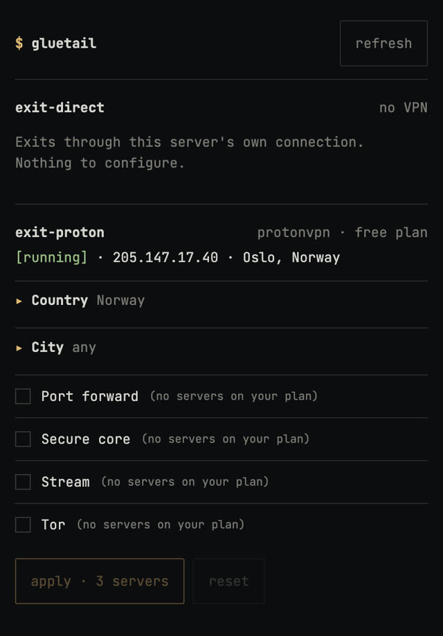

# gluetail

Tailscale exit nodes that can leave through a VPN provider, with a CLI and a small web UI to change where they exit.

gluetail runs [Tailscale](https://tailscale.com) exit nodes in Docker on a server you control. A node either
exits through the server's own connection or through a VPN provider via
[gluetun](https://github.com/qdm12/gluetun). Choose a node in the Tailscale client on any device, and change a
VPN node's country or city from the CLI or the web UI without touching the server.

## Why

Android and iOS run one VPN at a time. A phone that keeps Tailscale always on, to reach services at home,
cannot also run a VPN provider's app, so private access to home and VPN egress compete for the same slot.
gluetail provides the VPN egress as Tailscale exit nodes instead: Tailscale stays the only VPN on the device,
and the exit node and its location are chosen from the Tailscale app, the CLI or the web UI.

- **Several exit nodes side by side**: one direct, one per VPN provider or region, each selectable per device.
- **Any provider gluetun supports**: filters such as country, city and provider-specific options are generated
  from gluetun's own server data.
- **Declarative**: one small env file per node, rendered into a Compose file by `gluetail up`.
- **Live changes**: switch location through gluetun's control API; the choice is saved to the node file.


## Quick start

Requirements: a Linux host with Docker, Compose v2 and `/dev/net/tun`, and a Tailscale account with MagicDNS.
The one-time admin-console steps (auth key, approving exit nodes) are in [docs/tailscale-setup.md](docs/tailscale-setup.md).

```bash
git clone https://github.com/oallw/gluetail && cd gluetail
cp .env.example .env
cp nodes/direct.env.example nodes/direct.env
umask 077 && mkdir -p secrets data
echo 'TS_AUTHKEY=tskey-auth-...' > secrets/tailscale.env
./gluetail up
```

Approve the node as an exit node in the Tailscale admin console, then select it on a device.

To add a VPN node:

```bash
cp nodes/proton.env.example nodes/proton.env
echo 'WIREGUARD_PRIVATE_KEY=...' > secrets/proton.env
sed -i 's/^COMPOSE_PROFILES=.*/COMPOSE_PROFILES=direct,proton/' .env
./gluetail up
```

## Usage

```bash
./gluetail nodes                                   # configured nodes and their state
./gluetail status                                  # exit IP and location of each VPN node
./gluetail options proton                          # filters available for a node
./gluetail set proton countries=Japan cities=Tokyo # change location live, saved to the node file
./gluetail up                                      # apply configuration changes
```

The same controls are available in a web UI (`ui` profile), see [docs/web-ui.md](docs/web-ui.md).



## Configuration

A node is a file, `nodes/<name>.env`. Keys starting with `GLUETAIL_` configure gluetail; everything else is
passed to gluetun unchanged, so any option your provider supports works:

```ini
GLUETAIL_SECRETS=./secrets/proton.env
VPN_SERVICE_PROVIDER=protonvpn
VPN_TYPE=wireguard
SERVER_COUNTRIES=Netherlands
```

## Without gluetail

gluetail only generates Compose files. To run the setup by hand, this is the core of what `gluetail up` renders
for a VPN node: a Tailscale container shares gluetun's network namespace, so everything it forwards leaves
through the VPN tunnel.

```yaml
# docker-compose.yml
services:
  gluetun:
    image: qmcgaw/gluetun            # pin a version; templates/header.yml has the build gluetail is tested with
    cap_add: [NET_ADMIN]
    devices: ["/dev/net/tun:/dev/net/tun"]
    sysctls:
      - net.ipv4.ip_forward=1
      - net.ipv6.conf.all.forwarding=1
    env_file: [secrets/vpn.env]      # WIREGUARD_PRIVATE_KEY=...
    environment:
      - VPN_SERVICE_PROVIDER=protonvpn
      - VPN_TYPE=wireguard
      - SERVER_COUNTRIES=Netherlands
    volumes:
      - ./gluetun/post-rules.txt:/iptables/post-rules.txt:ro
    restart: unless-stopped

  tailscale:
    image: tailscale/tailscale:v1.102.5
    network_mode: "service:gluetun"
    depends_on:
      gluetun:
        condition: service_healthy
    cap_add: [NET_ADMIN]
    devices: ["/dev/net/tun:/dev/net/tun"]
    env_file: [secrets/tailscale.env]   # TS_AUTHKEY=...
    environment:
      - TS_HOSTNAME=exit-vpn
      - TS_STATE_DIR=/var/lib/tailscale
      - TS_USERSPACE=false
      - TS_EXTRA_ARGS=--advertise-exit-node
    command:
      - /bin/sh
      - -c
      - |
        ip rule add to 100.64.0.0/10 lookup 52 priority 99 2>/dev/null || true
        ip -6 rule add to fd7a:115c:a1e0::/48 lookup 52 priority 99 2>/dev/null || true
        exec /usr/local/bin/containerboot
    volumes:
      - ./data/tailscale:/var/lib/tailscale
    restart: unless-stopped
```

```
# gluetun/post-rules.txt
iptables -I FORWARD -i tailscale0 -o tun0 -j ACCEPT
iptables -I FORWARD -i tun0 -o tailscale0 -m conntrack --ctstate RELATED,ESTABLISHED -j ACCEPT
```

The `post-rules.txt` and the two `ip rule` lines are required; [docs/troubleshooting.md](docs/troubleshooting.md)
explains why. A direct node is the same `tailscale` service without `network_mode`, `depends_on` and `command`,
on the default network with the two `sysctls` from above. gluetail adds the pieces around this: the generated
filters, the control API, port publishing and the web UI.

## Documentation

- [Tailscale setup](docs/tailscale-setup.md): auth key, approving exit nodes, auto-approval
- [Configuration](docs/configuration.md): `.env`, node files, versions, systemd
- [CLI](docs/cli.md): commands, generated filters, how changes are applied
- [Web UI](docs/web-ui.md): enabling it, access options, security model
- [Attaching containers](docs/attaching-containers.md): routing other containers through a node
- [Troubleshooting](docs/troubleshooting.md): implementation notes and known issues
- [SECURITY.md](SECURITY.md)

## License

MIT, see [LICENSE](LICENSE). The bundled JetBrains Mono font in `web/fonts/` is under the SIL Open Font
License 1.1 (`web/fonts/OFL.txt`).

gluetail is an independent project, not affiliated with or endorsed by Tailscale Inc. or the gluetun project.
Using a VPN provider through it is subject to that provider's terms.
